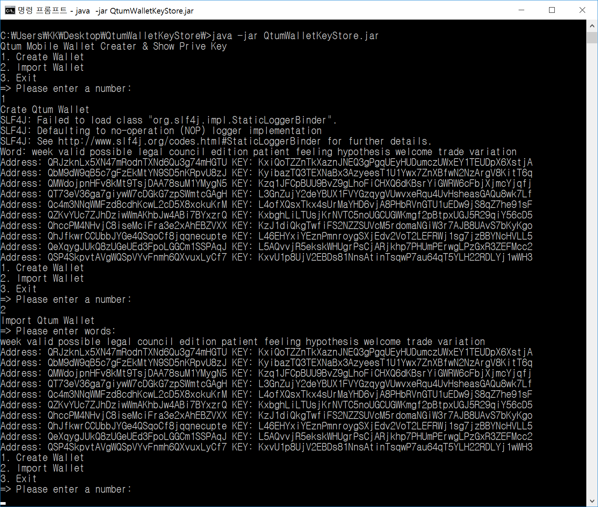
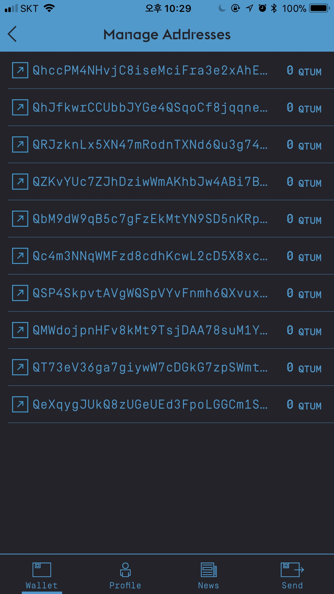
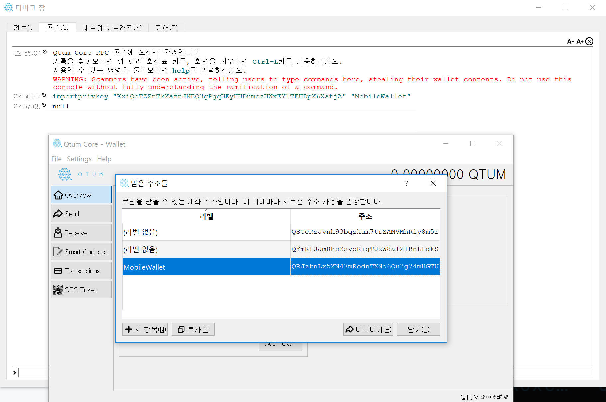

## **Warning / 경고**
### *This source code does not store or transmit wallet information.*
### *Please disconnect from the Internet to create a secure wallet.*
### *본 소스코드에는 지갑 정보를 저장하거나 전송하지 않습니다.*
### *안전한 지갑생성을 위해 인터넷의 접속을 끊고 생성하시기 바랍니다.*

# Qtum Mobile Wallet Creater & Show Prive Key
* It was built using the QTUM Android wallet source code to solve the synchronization problem between mobile wallet and PC wallet.
* Create a QTUM Mobile Wallet or check the PrivateKey on your QTUM mobile wallet.

## Preparations
1. Java must be pre-installed.
2. Download and extract the QtumWalletKeyStore.zip file from Release.

## How to run
1. At the command prompt, navigate to the extracted directory and run the following command:
<pre><code>
>java -jar QtumWalletKeyStore.jar
</code></pre>
2. To create a new wallet, select number 1 and check 12 words and PrivKey.
<pre><code>
1. Create Wallet
2. Import Wallet
3. Exit
=> Please enter a number:
1
Crate Qtum Wallet
Word: week valid possible legal council edition patient feeling hypothesis welcome trade variation
Address: QRJzknLx5XN47mRodnTXNd6Qu3g74mHGTU KEY: KxiQoTZZnTkXaznJNEQ3gPgqUEyHUDumczUWxEY1TEUDpX6XstjA
</code></pre>
3. To import an existing wallet, select 2 and enter 12 words to confirm PrivKey.
<pre><code>
1. Create Wallet
2. Import Wallet
3. Exit
=> Please enter a number:
2
Import Qtum Wallet
=> Please enter words:
week valid possible legal council edition patient feeling hypothesis welcome trade variation
Address: QRJzknLx5XN47mRodnTXNd6Qu3g74mHGTU KEY: KxiQoTZZnTkXaznJNEQ3gPgqUEyHUDumczUWxEY1TEUDpX6XstjA
...
</code></pre>
4. In the PC Wallet, create a wallet using the Debug window> PrivKey in the console.
<pre><code>
importprivkey "KxiQoTZZnTkXaznJNEQ3gPgqUEyHUDumczUWxEY1TEUDpX6XstjA" "MobileWallet"
</code></pre>

# What if it helps? Please support me.
# *QTUM : QWWVeDoz2HV63dmdagAUpqpJeVtvNw7dF1*
# *QTUM : QWWVeDoz2HV63dmdagAUpqpJeVtvNw7dF1*
# *QTUM : QWWVeDoz2HV63dmdagAUpqpJeVtvNw7dF1*

# Qtum Mobile Wallet Creater & Show Prive Key
* 모바일 지갑과 PC지갑 사이의 동기화 문제를 해결하기 위해 QTUM Android Wallet의 소스코드를 활용하여 제작 되었습니다.
* QTUM 모바일 지갑을 생성하거나 QTUM 모바일 지갑의 PrivateKey를 확인 합니다.

## 준비
1. Java가 미리 설치되어 있어야 합니다.
2. Release에 있는 QtumWalletKeyStore.zip파일을 다운로드하고 압축을 해제 합니다.

##  실행 방법
1. 명령 프롬프트에서 압축을 해제한 경로로 이동하여 아래 명령을 실행 합니다.
<pre><code>
>java -jar QtumWalletKeyStore.jar
</code></pre>
2. 새로운 지갑을 생성하려면 1번을 선택하고 12단어와 PrivKey를 저장 합니다.
<pre><code>
1. Create Wallet
2. Import Wallet
3. Exit
=> Please enter a number:
1
Crate Qtum Wallet
Word: week valid possible legal council edition patient feeling hypothesis welcome trade variation
Address: QRJzknLx5XN47mRodnTXNd6Qu3g74mHGTU KEY: KxiQoTZZnTkXaznJNEQ3gPgqUEyHUDumczUWxEY1TEUDpX6XstjA
</code></pre>
3. 기존 지갑을 가져오시려면 2번을 선택하고 12단어를 입력하여 PrivKey를 확인합니다.
<pre><code>
1. Create Wallet
2. Import Wallet
3. Exit
=> Please enter a number:
2
Import Qtum Wallet
=> Please enter words:
week valid possible legal council edition patient feeling hypothesis welcome trade variation
Address: QRJzknLx5XN47mRodnTXNd6Qu3g74mHGTU KEY: KxiQoTZZnTkXaznJNEQ3gPgqUEyHUDumczUWxEY1TEUDpX6XstjA
...
</code></pre>
4. PC Wallet에 디버그창>콘솔에서 PrivKey를 이용하여 지갑을 생성 합니다.
<pre><code>
importprivkey "KxiQoTZZnTkXaznJNEQ3gPgqUEyHUDumczUWxEY1TEUDpX6XstjA" "MobileWallet"
</code></pre>

# 도움이 되셨다면? 후원해 주세요!
# *QTUM : QWWVeDoz2HV63dmdagAUpqpJeVtvNw7dF1*
# *QTUM : QWWVeDoz2HV63dmdagAUpqpJeVtvNw7dF1*
# *QTUM : QWWVeDoz2HV63dmdagAUpqpJeVtvNw7dF1*

 
 
 
